[README (1).md](https://github.com/user-attachments/files/24133899/README.1.md)
# 📦 Order Processing & Analytics Pipeline on AWS

#### This project showcases a full end-to-end serverless data pipeline built using multiple AWS services — from a simple order form to complete analytics and visualization.

### 🚀 Overview

##### A user submits an order form (HTML, CSS, JS) hosted on Amazon S3 with CloudFront distribution. The form triggers a REST API that invokes a Lambda function, which stores order data into DynamoDB. Separately, a CSV dataset stored in S3 undergoes processing via AWS Glue, and both data sources are combined, cleaned, transformed into Parquet, and queried through Athena and Redshift Spectrum. Finally, insights and graphs are created using Amazon QuickSight.

---
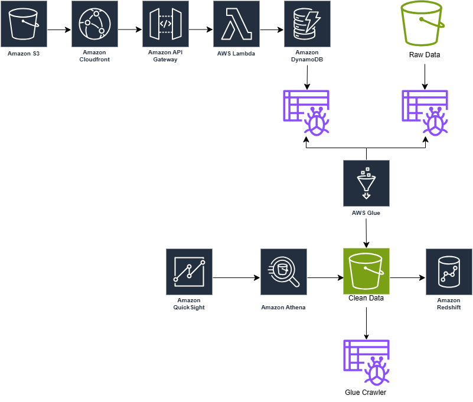

### 🔧 AWS Services Used -
#### 1. Frontend & Hosting

- Amazon S3 – Static website hosting for HTML/CSS/JS files

- Amazon CloudFront – CDN distribution for fast global delivery

#### 2. Backend & Order Processing

- Amazon API Gateway – REST API for form submission

- AWS Lambda – Serverless backend to process orders

- Amazon DynamoDB – NoSQL database to store order records Data   Storage

- Amazon S3 – Raw CSV storage & processed Parquet output

#### 3. Data Catalog & ETL

- AWS Glue Database – Central metadata catalog

- AWS Glue Crawlers – Auto-detect schema for DynamoDB & S3

- AWS Glue ETL Job – Clean, transform, merge data & output Parquet

#### 4. Querying & Analytics

- Amazon Athena – SQL querying on S3 (processed data)

- Amazon Redshift Spectrum – External schema to query S3 Parquet

- Amazon QuickSight – Visual dashboards & analytics
---
### 🛠️ Setup Guide :

Follow these steps to recreate the full end-to-end pipeline.

### 📌 1. Create and Host Frontend (S3 + CloudFront) =
#### 1.1) Create S3 Bucket -

- Open S3 → Create bucket

- Bucket name must be globally unique.

- Disable block public access.

- Choose an KMS key for encryption of data

- Upload your index.html, styles.css, and script.js.


---
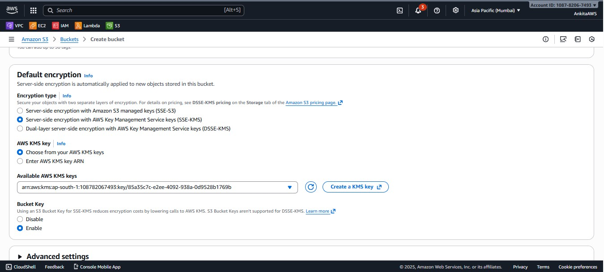

#### 1.2) Enable Static Website Hosting -

- Go to Properties → Static Website Hosting

- Enable hosting

- Set:

     -> Index document: index.html

- Copy the website Endpoint URL.

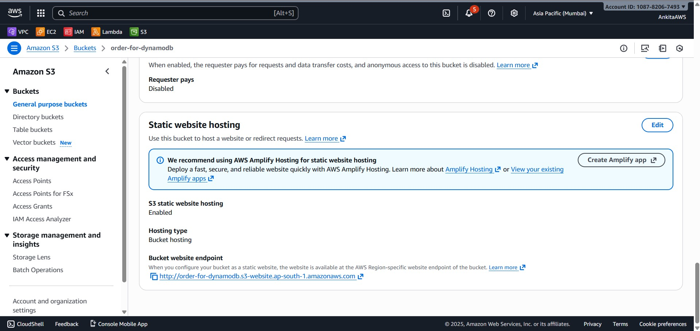

#### 1.3) Configure Bucket Policy -
```
{
  "Version": "2012-10-17",
  "Statement": [
    {
      "Sid": "AllowCloudFrontOACAccess",
      "Effect": "Allow",
      "Principal": {
        "Service": "cloudfront.amazonaws.com"
      },
      "Action": "s3:GetObject",
      "Resource": "arn:aws:s3:::YOUR_BUCKET_NAME/*",
      "Condition": {
        "StringEquals": {
          "AWS:SourceArn": "arn:aws:cloudfront::YOUR_AWS_ACCOUNT_ID:distribution/YOUR_DISTRIBUTION_ID"
        }
      }
    }
  ]
}
```
🔧 What to Replace -

- 'YOUR_BUCKET_NAME' → your S3 bucket

- 'YOUR_AWS_ACCOUNT_ID' → your AWS account number

- 'YOUR_DISTRIBUTION_ID' → CloudFront distribution ID (ex: E3ABCDE12345F6)

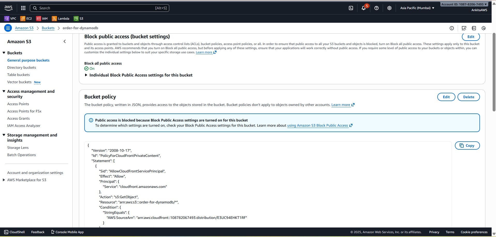

#### 1.4) Create CloudFront Distribution -

- Open CloudFront → Create Distribution
- Distribution type → Single website or app

- Origin → S3 static website endpoint

- Default root object → index.html

Copy Distribution domain name URL
(Use this instead of the raw S3 URL)

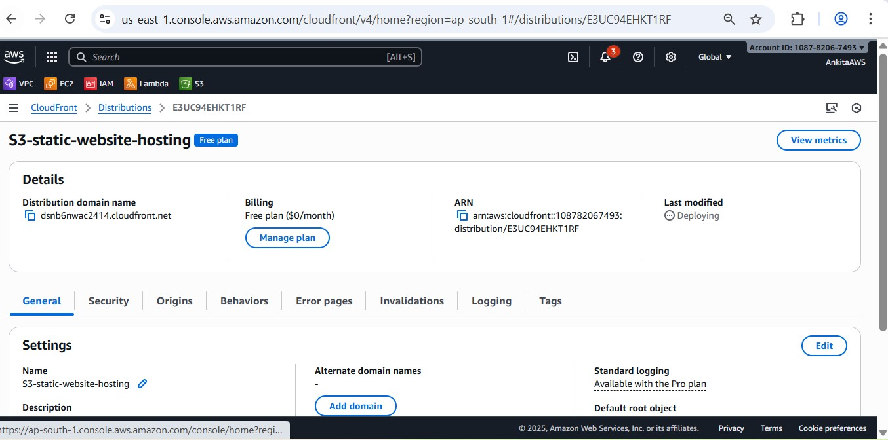
---
### 📌 2. Create Order Submission API (API Gateway + Lambda + DynamoDB) =
#### 2.1) Create DynamoDB Table -

- Table name: Orders

- Primary key: order_id (String)

- Other attributes stored dynamically:

   -> amount

   -> date

   -> store_id

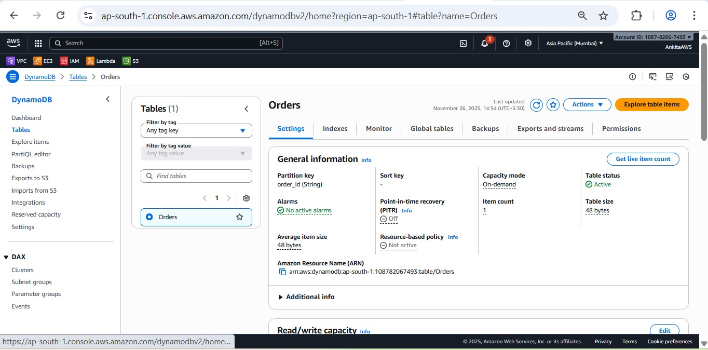   

#### 2.2) Create Lambda Function

- Runtime → Python

- Add the code to:

  -> Read data from API payload

  -> Store into DynamoDB

Example :
```
import json
import boto3
import os
from decimal import Decimal

dynamodb = boto3.resource('dynamodb')
table_name = os.environ['TABLE_NAME']
table = dynamodb.Table(table_name)

def lambda_handler(event, context):
    print("Event:", event)

    # Handle OPTIONS preflight for CORS
    if event.get("requestContext", {}).get("http", {}).get("method") == "OPTIONS":
        return {
            "statusCode": 200,
            "headers": {
                "Access-Control-Allow-Origin": "*",
                "Access-Control-Allow-Headers": "Content-Type,Authorization",
                "Access-Control-Allow-Methods": "OPTIONS,POST"
            },
            "body": ""
        }

    try:
        # Extract body
        body = event.get("body")
        if isinstance(body, str):
            body = json.loads(body) if body.strip() else {}
        elif isinstance(body, dict):
            pass
        else:
            body = {}

        # Fallback for test events
        if not body:
            body = event

        # Required fields
        order_id = body.get('order_id')
        store_id = body.get('store_id')

        if not all([order_id, store_id]):
            raise ValueError("Missing required fields: order_id and store_id")

        # Optional fields
        date = body.get('date', 'N/A')
        amount = body.get('amount', 0)

        # Convert amount to Decimal
        try:
            amount_decimal = Decimal(str(amount))
        except Exception:
            amount_decimal = Decimal('0')

        # Item for DynamoDB
        item = {
            'order_id': order_id,
            'store_id': store_id,
            'date': date,
            'amount': amount_decimal
        }

        # Save to DynamoDB
        table.put_item(Item=item)

        return {
            "statusCode": 200,
            "headers": {
                "Access-Control-Allow-Origin": "*",
                "Access-Control-Allow-Headers": "Content-Type,Authorization",
                "Access-Control-Allow-Methods": "OPTIONS,POST"
            },
            "body": json.dumps({
                "message": "Order saved successfully",
                "item": {
                    "order_id": order_id,
                    "store_id": store_id,
                    "date": date,
                    "amount": float(amount_decimal)
                }
            })
        }

    except Exception as e:
        print("Error:", e)
        return {
            "statusCode": 500,
            "headers": {
                "Access-Control-Allow-Origin": "*",
                "Access-Control-Allow-Headers": "Content-Type,Authorization",
                "Access-Control-Allow-Methods": "OPTIONS,POST"
            },
            "body": json.dumps({"error": str(e)})
        }
```
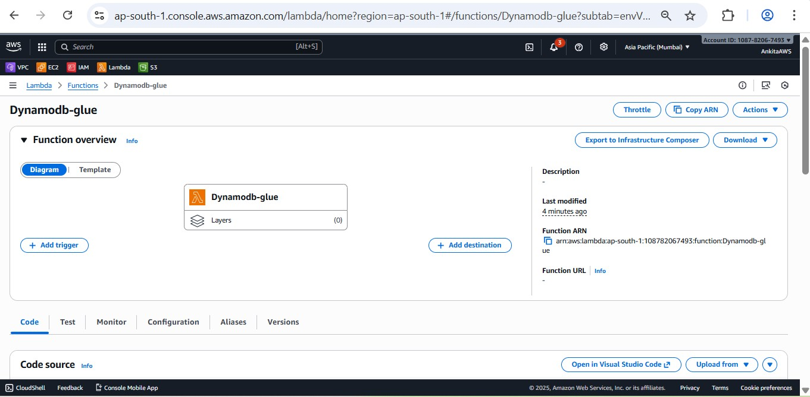

#### 2.3) Create API Gateway REST API -

2.3.1] Create a New REST API :-

-    Go to API Gateway in AWS Console

- Select APIs → Create API

- Choose REST API (the original one, not HTTP API)

- Choose : Build

- API name: REST-API-Lambda (or any name)

- Endpoint type: Regional

- Click Create API

2.3.2] Create the Base Resource / :-

The root resource / is created automatically.
You will add your endpoint under it.

2.3.3] Create Resource /submit-order :-

- In the left menu, under your API name, select /

- Click Actions → Create Resource

- Enter:

  -> Resource Name: submit-order

  -> Resource Path: /submit-order

-  Click Create Resource

- You should now see:
```
/
  /submit-order
  ```
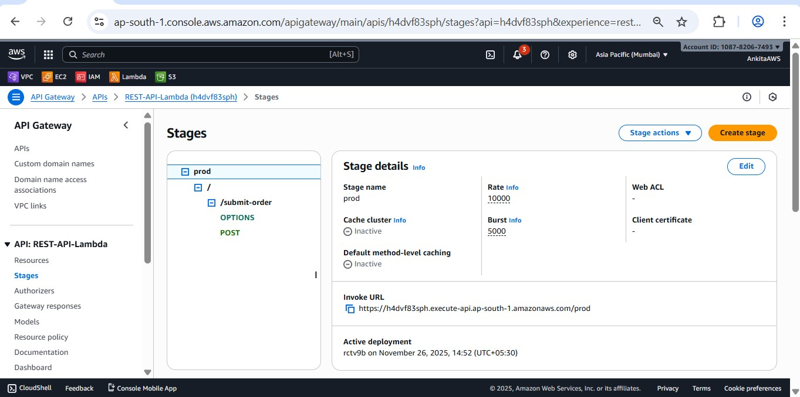
  

2.3.4] Add POST method :-

- Select /submit-order

- Click Actions → Create Method

- Choose POST

- Click ✓ to confirm

- Configure:

  -> Integration type: Lambda Function

  -> Region: your region (e.g., ap-south-1)

  -> Lambda Function: select your order Lambda

- Click Save

- API Gateway will ask for permission → click OK

- Now your POST method invokes your Lambda.

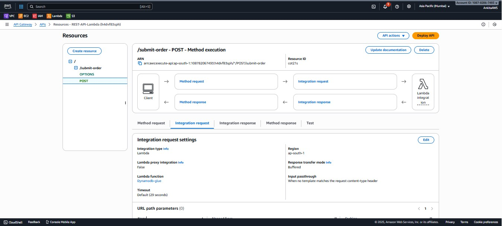

2.3.5] Add OPTIONS method (for CORS) :-

- Select /submit-order

- Click Actions → Create Method

- Choose OPTIONS

- Integration type: Mock Integration

- Click Save


2.3.6] Configure CORS on OPTIONS Method :-

- Click OPTIONS under /submit-order

- Go to Integration Response

- Expand Header Mappings for 200 response

- Add the following headers:
```
Access-Control-Allow-Origin	    ' * '
Access-Control-Allow-Methods	'POST,OPTIONS'
Access-Control-Allow-Headers	'Content-Type,Authorization'
```
(These must be typed including single quotes)

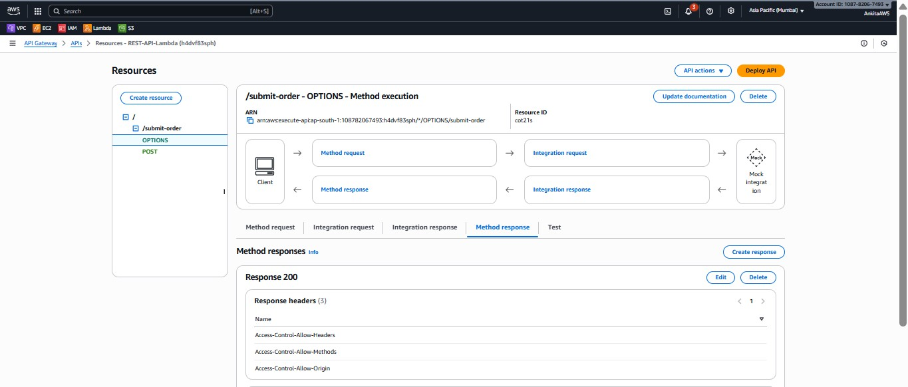

2.3.7] Add CORS Headers to POST Method Response :-

- Select POST

- Go to Method Response

- Click Add Response Header

  -> Access-Control-Allow-Origin

  -> Access-Control-Allow-Headers

  -> Access-Control-Allow-Methods

- Go to Integration Response → 200 Response

- Add header mappings:
```
Access-Control-Allow-Origin → ' * '

Access-Control-Allow-Headers → 'Content-Type,Authorization'

Access-Control-Allow-Methods → 'POST,OPTIONS'
```
This ensures frontend browsers accept your API response.

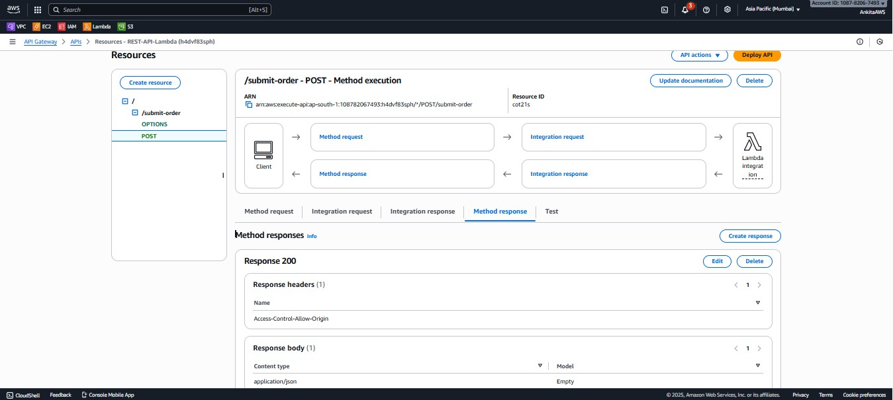

2.3.8] Deploy the API -

- Click Actions → Deploy API

- Create a new stage:

- Stage name: prod

- Click Deploy

   After deploy, you get a public API URL like:
```
https://<api-id>.execute-api.<region>.amazonaws.com/prod/submit-order
```

- This is the URL you put in your JavaScript.

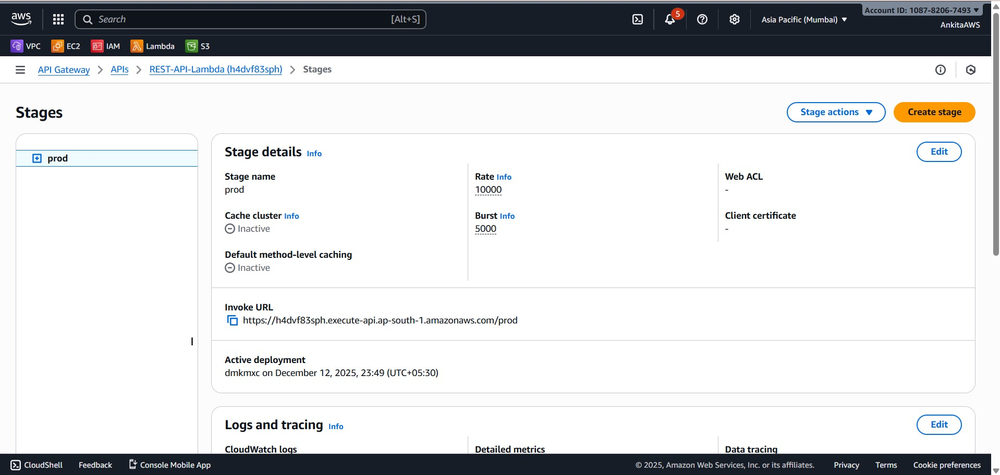


### 📌 3. Upload CSV Dataset to S3 = 
#### 3.1) Create S3 Bucket -

- Create an S3 bucket to store :
  
  ->Raw CSV data

  ->Processed (curated) Parquet data

  ->Temporary folders

  ->Frontend script (optional)

- Example bucket name (use your own):
```
glue-pipeline-ankita 
```
- Upload your csv file into retail-sales-raw\ folder 

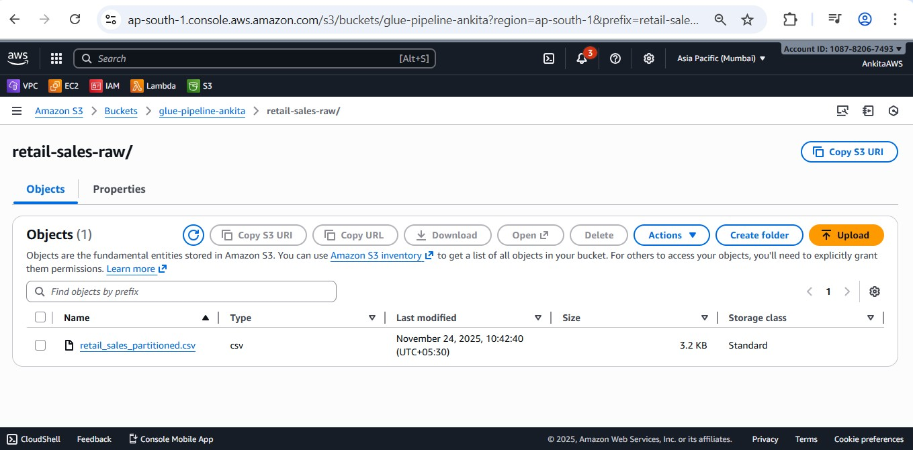 


#### S3 Folder Structure

- Your bucket should have the following folders:
```
your-glue-pipeline-bucket
│
├── retail-sales-raw/         # Contains raw CSV dataset uploaded by you for processinge
│
├── retail-sales-curated/     # Glue ETL job will store cleaned Parquet output here
│
├── script/                   # folder to store frontend JS or supporting code
│
└── temp/                     # Temporary folder for Glue job bookmarks or checkpoints
```
- Enable KMS Key protection while creating folders

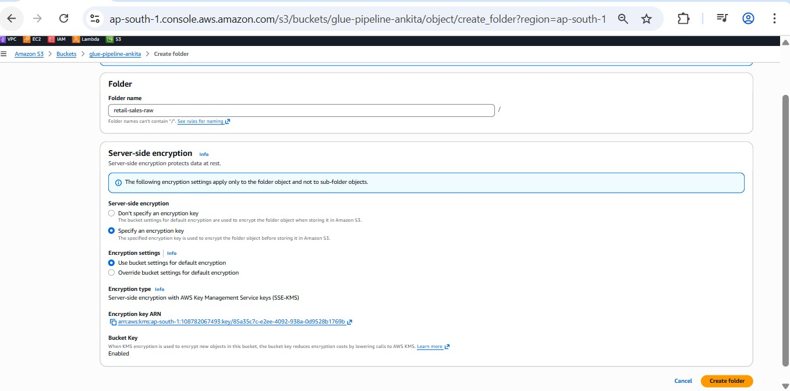
---
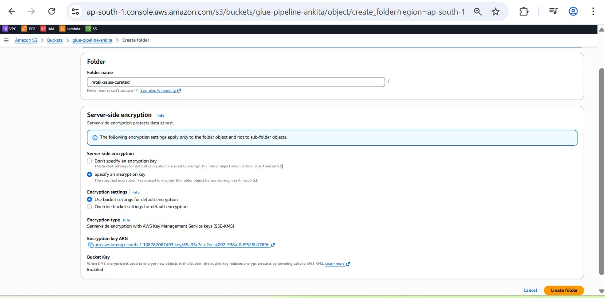 
### 📌 4. Create AWS Glue Database & Crawlers =

#### 4.1) Create Glue Database -

- Create a database for metadata catalog :

   -> glue_database_name : my-project-db

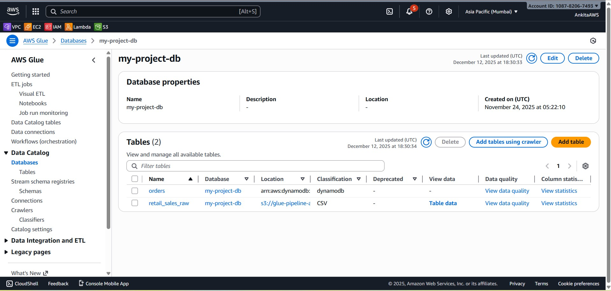

#### 4.2) Create Glue Crawlers -

#### ⭐ Crawler A — DynamoDB Crawler :-

4.2.1] Set Crawler Properties :-

- Go to AWS Glue Console → Crawlers → Create crawler

- Enter:

  -> Name : Glue Crawler for Dynamodb

- Click Next

4.2.2] Choose Data Sources and Classifiers :-

- Click Add a data source

- Select DynamoDB

- Enter table name : Orders

- Leave default classifiers (no need for custom classifiers)

- Click Add

- Click Next

4.2.3] Configure Security Settings :-

- Choose or create an IAM role :  
  Name it -> dynamodb-crawler-role-glue
```
{
  "Version": "2012-10-17",
  "Statement": [
    {
      "Effect": "Allow",
      "Action": [
        "dynamodb:DescribeTable",
        "dynamodb:Scan",
        "dynamodb:GetItem"
      ],
      "Resource": "arn:aws:dynamodb:REGION:ACCOUNT_ID:table/Orders"
    },
    {
      "Effect": "Allow",
      "Action": [
        "logs:CreateLogGroup",
        "logs:CreateLogStream",
        "logs:PutLogEvents"
      ],
      "Resource": "arn:aws:logs:REGION:ACCOUNT_ID:log-group:/aws-glue/*"
    },
    {
      "Effect": "Allow",
      "Action": [
        "glue:GetDatabase",
        "glue:GetDatabases",
        "glue:GetTable",
        "glue:GetTables",
        "glue:CreateTable",
        "glue:UpdateTable"
      ],
      "Resource": [
        "arn:aws:glue:REGION:ACCOUNT_ID:catalog",
        "arn:aws:glue:REGION:ACCOUNT_ID:database/*",
        "arn:aws:glue:REGION:ACCOUNT_ID:table/*/*"
      ]
    }
  ]
}

```

- Network settings: Default (DynamoDB does not require VPC)

- Click Next

4.2.4] Set Output and Scheduling :-

(A) Output ->

- Choose Target database : my-project-db

(B) Schedule ->

- Choose On demand (recommended) Or set hourly/daily if data changes frequently

- Click Next

4.2.5] Review and Create :-

- Verify:

  ->Crawler Name

  ->DynamoDB Table

  ->IAM Role

  ->Target Database
- Then click Create crawler.

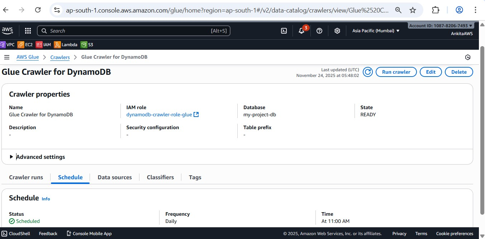

4.2.6] Run Crawler :-
- Click on Run Crawler (It will store schema of the table)

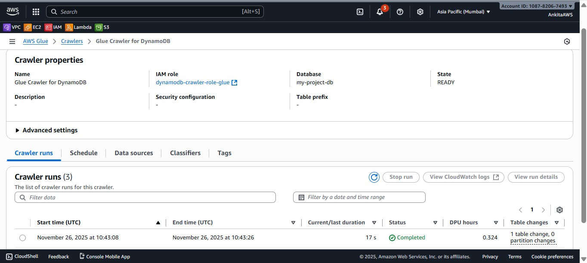

#### ⭐ Crawler B — S3 CSV Crawler :-

4.2.1] Set Crawler Properties :- 

- Go to Create crawler

- Name : Glue Crawler for S3

- Click Next

4.2.2] Choose Data Sources and Classifiers :-

- Click Add data source

- Select S3

- Choose S3 Path:

  ```s3://glue-pipeline-ankita/retail-sales-raw/retail_sales_partitioned.csv```

- Choose Subsequent crawler runs : Crawl all sub-folders

- Click Next

4.2.3] Configure Security Settings :-

- Choose or create an IAM role :

  Name it -> AWSGlueServiceRole-for-s3
```
{
    "Version": "2012-10-17",
    "Statement": [
        {
            "Effect": "Allow",
            "Action": [
                "s3:GetObject",
                "s3:PutObject"
            ],
            "Resource": [
                "arn:aws:s3:::example-bucket/retail-sales-raw/*"
            ],
            "Condition": {
                "StringEquals": {
                    "aws:ResourceAccount": "ACCOUNT_ID"
                }
            }
        },
        {
            "Effect": "Allow",
            "Action": [
                "kms:Decrypt",
                "kms:DescribeKey"
            ],
            "Resource": "arn:aws:kms:REGION:ACCOUNT_ID:key/KEY_ID"
        },
        {
            "Effect": "Allow",
            "Action": [
                "glue:GetDatabase",
                "glue:GetDatabases",
                "glue:GetTable",
                "glue:GetTables",
                "glue:CreateTable",
                "glue:UpdateTable"
            ],
            "Resource": [
                "arn:aws:glue:REGION:ACCOUNT_ID:catalog",
                "arn:aws:glue:REGION:ACCOUNT_ID:database/*",
                "arn:aws:glue:REGION:ACCOUNT_ID:table/*/*"
            ]
        },
        {
            "Effect": "Allow",
            "Action": [
                "glue:*",
                "s3:GetBucketLocation",
                "s3:ListBucket",
                "s3:ListAllMyBuckets",
                "s3:GetBucketAcl",
                "ec2:DescribeVpcEndpoints",
                "ec2:DescribeRouteTables",
                "ec2:CreateNetworkInterface",
                "ec2:DeleteNetworkInterface",
                "ec2:DescribeNetworkInterfaces",
                "ec2:DescribeSecurityGroups",
                "ec2:DescribeSubnets",
                "ec2:DescribeVpcAttribute",
                "iam:ListRolePolicies",
                "iam:GetRole",
                "iam:GetRolePolicy",
                "cloudwatch:PutMetricData"
            ],
            "Resource": [
                "*"
            ]
        },
        {
            "Effect": "Allow",
            "Action": [
                "s3:CreateBucket"
            ],
            "Resource": [
                "arn:aws:s3:::aws-glue-*"
            ]
        },
        {
            "Effect": "Allow",
            "Action": [
                "s3:GetObject",
                "s3:PutObject",
                "s3:DeleteObject"
            ],
            "Resource": [
                "arn:aws:s3:::aws-glue-*/*",
                "arn:aws:s3:::*/*aws-glue-*/*"
            ]
        },
        {
            "Effect": "Allow",
            "Action": [
                "s3:GetObject"
            ],
            "Resource": [
                "arn:aws:s3:::crawler-public*",
                "arn:aws:s3:::aws-glue-*"
            ]
        },
        {
            "Effect": "Allow",
            "Action": [
                "logs:CreateLogGroup",
                "logs:CreateLogStream",
                "logs:PutLogEvents"
            ],
            "Resource": [
                "arn:aws:logs:*:*:*:/aws-glue/*"
            ]
        },
        {
            "Effect": "Allow",
            "Action": [
                "ec2:CreateTags",
                "ec2:DeleteTags"
            ],
            "Condition": {
                "ForAllValues:StringEquals": {
                    "aws:TagKeys": [
                        "aws-glue-service-resource"
                    ]
                }
            },
            "Resource": [
                "arn:aws:ec2:*:*:network-interface/*",
                "arn:aws:ec2:*:*:security-group/*",
                "arn:aws:ec2:*:*:instance/*"
            ]
        }
    ]
}
```

- Network : Default (no VPC unless S3 endpoint/private setup)

- Click Next

4.2.4] Set Output and Scheduling :-

(A) Output ->

- Choose target database : my-project-db

(B) Schedule ->

- Select On demand (common) Or schedule (hourly/daily) if CSV files keep updating

- Click Next

4.2.5] Step 5: Review and Create ;-

- Verify everything and click Create crawler.

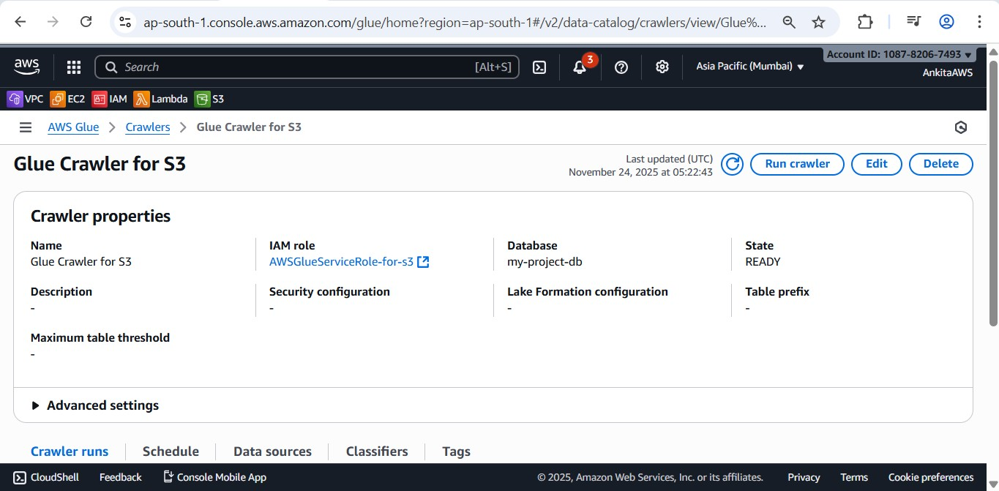

4.2.6] Run Crawler :-
- Click on Run Crawler (It will store schema of the table)

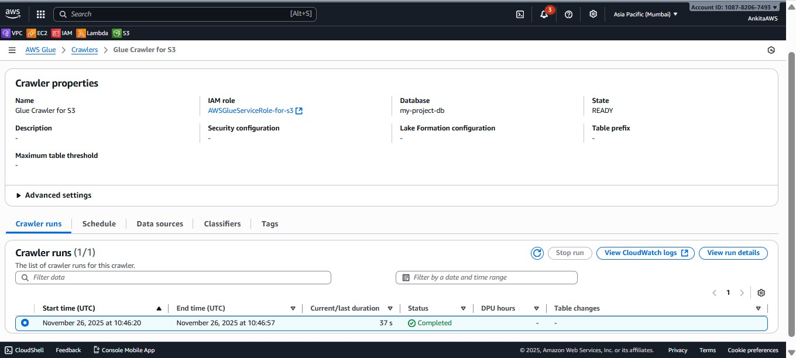
### 📌 5. Create AWS Glue ETL Job =
#### 5.1) Choose ETL jobs -
- Choose : Script editor
- Paste below script and Save
```
import sys
import traceback
from awsglue.utils import getResolvedOptions
from pyspark.context import SparkContext
from awsglue.context import GlueContext
from awsglue.job import Job
from pyspark.sql.functions import year, month, dayofmonth, col, lit
from pyspark.sql.types import DateType

args = getResolvedOptions(sys.argv, ['JOB_NAME'])
sc = SparkContext()
glueContext = GlueContext(sc)
spark = glueContext.spark_session
logger = glueContext.get_logger()

job = Job(glueContext)
job.init(args['JOB_NAME'], args)

try:
    logger.info("=== DEBUG ETL START ===")

    # -----------------------------
    # Load Data
    # -----------------------------
    s3_raw = glueContext.create_dynamic_frame.from_catalog(
        database="my-project-db",
        table_name="retail_sales_raw"
    ).toDF()

    ddb_raw = glueContext.create_dynamic_frame.from_catalog(
        database="my-project-db",
        table_name="orders"
    ).toDF()

    logger.info(f"S3 CSV rows: {s3_raw.count()}")
    logger.info(f"DynamoDB rows: {ddb_raw.count()}")

    # -----------------------------
    # Schema Alignment
    # -----------------------------
    all_cols = list(set(s3_raw.columns).union(set(ddb_raw.columns)))

    for col_name in all_cols:
        if col_name not in s3_raw.columns:
            s3_raw = s3_raw.withColumn(col_name, lit(None))
        if col_name not in ddb_raw.columns:
            ddb_raw = ddb_raw.withColumn(col_name, lit(None))

    combined = s3_raw.select(all_cols).unionByName(ddb_raw.select(all_cols))
    logger.info(f"Rows After Union: {combined.count()}")

    # -----------------------------
    # Remove duplicates
    # -----------------------------
    combined = combined.dropDuplicates()
    logger.info(f"Rows After Dedup: {combined.count()}")

    # -----------------------------
    # Validate Date Column
    # -----------------------------
    if "date" not in combined.columns:
        raise Exception("DATE COLUMN MISSING")

    combined = combined.withColumn("date", col("date").cast(DateType()))
    combined = combined.filter(col("date").isNotNull())
    logger.info(f"Rows After Date Cleanup: {combined.count()}")

    # -----------------------------
    # Add Partition Columns
    # -----------------------------
    combined = (
        combined
        .withColumn("year", year("date"))
        .withColumn("month", month("date"))
        .withColumn("day", dayofmonth("date"))
    )

    # -----------------------------
    # Write Parquet Output
    # -----------------------------
    output_path = "s3://your-output-bucket/retail-sales-curated/"

    (combined.write
        .mode("overwrite")
        .partitionBy("year", "month", "day")
        .option("parquet.enable.summary-metadata", "false")
        .option("mapreduce.fileoutputcommitter.algorithm.version", "2")
        .option("fs.s3a.committer.name", "directory")
        .option("fs.s3a.committer.staging.conflict-mode", "replace")
        .option("fs.s3a.committer.staging.tmp.path", "s3://your-temp-bucket/temp/")
        .option("mapreduce.fileoutputcommitter.marksuccessfuljobs", "false")
        .parquet(output_path)
    )

    logger.info("=== DEBUG ETL END ===")

except Exception as e:
    logger.error("ETL FAILED")
    logger.error(str(e))
    logger.error(traceback.format_exc())
    raise e

finally:
    job.commit()
```
When you save the script it will store your script in S3 bucket location.

#### 5.2) Create ETL job detail -
5.2.1] Basic Properties :-

- Job Name: glue-to-s3

- IAM Role:

  Select IAM role -> etl-GlueRole-dynamodb-s3-to-parquet 
```
{
    "Version": "2012-10-17",
    "Statement": [
        {
            "Sid": "S3FullAccessForGlue",
            "Effect": "Allow",
            "Action": [
                "s3:GetObject",
                "s3:PutObject",
                "s3:DeleteObject",
                "s3:ListBucket"
            ],
            "Resource": [
                "arn:aws:s3:::glue-pipeline-ankita",
                "arn:aws:s3:::glue-pipeline-ankita/*"
            ]
        },
        {
            "Sid": "DynamoDBReadAccess",
            "Effect": "Allow",
            "Action": [
                "dynamodb:Scan",
                "dynamodb:Query",
                "dynamodb:DescribeTable",
                "dynamodb:GetItem",
                "dynamodb:BatchGetItem"
            ],
            "Resource": "*"
        },
        {
            "Sid": "GlueCatalogAccess",
            "Effect": "Allow",
            "Action": [
                "glue:GetDatabase",
                "glue:GetDatabases",
                "glue:GetTable",
                "glue:GetTables",
                "glue:GetPartitions",
                "glue:BatchGetPartition",
                "glue:CreateTable",
                "glue:UpdateTable",
                "glue:DeleteTable"
            ],
            "Resource": "*"
        },
        {
            "Sid": "CloudWatchLogsAccess",
            "Effect": "Allow",
            "Action": [
                "logs:CreateLogGroup",
                "logs:CreateLogStream",
                "logs:PutLogEvents"
            ],
            "Resource": "*"
        },
        {
            "Sid": "KMSFullAccessForGlue",
            "Effect": "Allow",
            "Action": [
                "kms:Encrypt",
                "kms:Decrypt",
                "kms:GenerateDataKey",
                "kms:GenerateDataKeyWithoutPlaintext",
                "kms:ReEncrypt*",
                "kms:DescribeKey",
                "kms:CreateGrant",
                "kms:ListGrants",
                "kms:RevokeGrant"
            ],
            "Resource": "arn:aws:kms:ap-south-1:108782067493:key/85a35c7c-e2ee-4092-938a-0d9528b1769b"
        }
    ]
}
```

5.2.2] Job Type & Version :-

- Type: Spark

- Glue Version: Glue 5.0 - Supports spark 3.5, Scala 2, Python 3

- Language: Python 3

5.2.3] Worker Configuration :-

- Worker Type: G 1X (4 vCPU, 16GB RAM)

- Autoscaling: Enabled (recommended)

- Requested Number of Workers: 10

- Generate Job Insights: Enabled (optional)

- Generate Lineage Events: Enabled

- Job Bookmark: Disabled (Job processes full dataset every run)

5.2.4] Retry & Timeout :-

- Number of Retries: 0

- Job Timeout: 480 minutes (default)

5.2.5] Script Settings :-

- Script Filename: glue-to-s3.py

- Script Path:
```
  s3://glue-pipeline-ankita/script/
```

- Temporary Directory:
```
  s3://glue-pipeline-ankita/temp/
```

5.2.6] Logging & Monitoring :-

- Job Metrics: Enabled

- Observability Metrics: Enabled

- Continuous Logging: Enabled

- Spark UI Logs Path:
```
  s3://glue-pipeline-ankita/sparkHistoryLogs/
```
- Spark UI Mode: Standard (recommended)

5.2.7] Concurrency :-

- Max Concurrent Runs: 1
  
  (Avoid overlapping ETL runs)

5.2.8] Security Settings :-

- Security Configuration: None (optional)

- Server-side Encryption : Enable S3-SSE if required for your bucket.

- Use Glue Data Catalog as Hive Metastore: Optional.

- Save

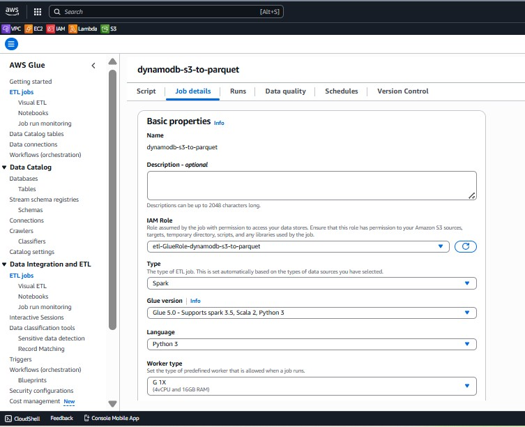

5.2.9] Run the Job :-

- Click Save

- Click Run

- Monitor logs at:

  -> CloudWatch Logs

  -> Spark UI (for job stages)

5.2.10] Output After ETL Job :-

Your final curated and partitioned Parquet files will appear:
```
s3://your-output-bucket/retail-sales-curated/
    year=2025/
        month=*/
            day=*/
                part-0000.parquet
```
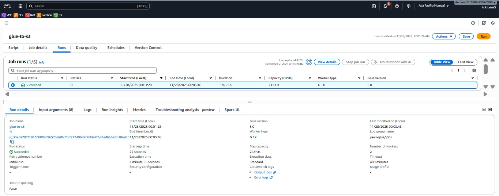
---
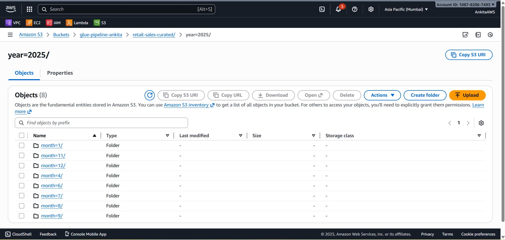

### 📌 6. Integrate with Amazon Redshift (Spectrum) =

#### 6.1) Create Redshift Serverless Workgroup -

- Go to Amazon Redshift Console

- Left Sidebar → Redshift Serverless

- Click Create workgroup

- Fill Workgroup Settings :-

  -> Workgroup name : default-workgroup


  -> Base capacity : Choose based on expected workload (e.g., 32 RPU)

  -> Publicly Accessible : ON

  -> VPC settings :-
    
    - Select : 1 VPC

    - Subnets (typically 2+ availability zones)

    - Security groups 

- Click Next

#### 6.2) Choose or Create Namespace -

- You can select an existing namespace or create a new one.

- If creating new namespace:

- Choose Create a new namespace

- Fill details:-

  -> Namespace Name : serverless-redshift

  -> Admin username : admin

  -> Admin password : Set a secure password.

  -> Database name : dev

  -> IAM Role : Choose the existing IAM role or Create IAM Role
  
    - Name it : AWS-redshift-iam
```
{
    "Version": "2012-10-17",
    "Statement": [
        {
            "Effect": "Allow",
            "Action": [
                "s3:Get*",
                "s3:List*",
                "s3:Describe*",
                "s3-object-lambda:Get*",
                "s3-object-lambda:List*"
            ],
            "Resource": "*"
        },
        {
            "Effect": "Allow",
            "Action": [
                "s3:Get*",
                "s3:List*",
                "s3:Describe*",
                "s3-object-lambda:Get*",
                "s3-object-lambda:List*"
            ],
            "Resource": "*"
        },
        {
            "Effect": "Allow",
            "Action": [
                "kms:Decrypt",
                "kms:DescribeKey",
                "kms:GenerateDataKey*"
            ],
            "Resource": "arn:aws:kms:ap-south-1:<ACCOUNT_ID>:key/85a35c7c-e2ee"
        },
        {
            "Effect": "Allow",
            "Action": [
                "glue:GetDatabase",
                "glue:GetDatabases",
                "glue:GetTable",
                "glue:GetTables",
                "glue:CreateDatabase",
                "glue:CreateTable",
                "glue:GetPartition",
                "glue:GetPartitions"
            ],
            "Resource": "*"
        }
    ]
}

```

- Click Next

#### 6.3) Review & Create -

- Review your:

  ->Workgroup name

  ->Namespace name

  -> VPC / Subnets

  -> Security Groups

  -> IAM Role

  -> Base capacity

- Click Create

- AWS will now:

  -> Create Namespace

  -> Create Workgroup

  -> Attach IAM role

  -> Provision Serverless compute

This takes ~1–2 minutes.

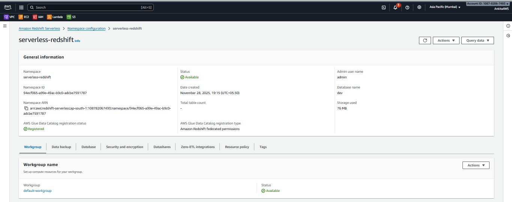
---
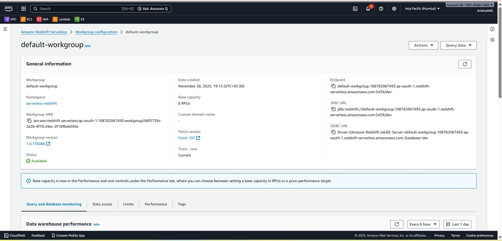


#### 6.4) Create External Table and Query S3 Data in Redshift Serverless -

6.4.1] Open Redshift Serverless :-

- Go to Amazon Redshift console.

- Click Workgroups.

- Select the workgroup you created

- Click Query data (top-right).

- Choose Query in Query Editor v2.

This opens the Redshift Query Editor v2 in a new tab.

6.4.2] Connect to Namespace :-

- Select your Namespace (example: serverless-redshift).

- Select Default database (or whichever DB you created earlier).

- Click Connect.

6.4.3] Create External Schema (Run this first) :-

Only if not already created.
```
CREATE EXTERNAL SCHEMA spectrum_schema
FROM DATA CATALOG
DATABASE 'glue_database_name'
IAM_ROLE 'arn:aws:iam::<account-id>:role/AWS-redshift-iam'
CREATE EXTERNAL DATABASE IF NOT EXISTS;
```

6.4.4] Create External Table for S3 Parquet :-

In Query Editor, run this query:
```
CREATE EXTERNAL TABLE spectrum_schema.retail_sales (
    id INT,
    date DATE,
    store_id INT,
    product_id INT,
    quantity INT,
    sales_amount DECIMAL(10,2)
)
PARTITIONED BY (year INT, month INT, day INT)
STORED AS PARQUET
LOCATION 's3://glue-pipeline-ankita/retail-sales-curated/';
```

6.4.5] Load Glue Partitions :-

This detects all S3 folders like year/month/day/
```
MSCK REPAIR TABLE spectrum_schema.retail_sales;
```

6.4.6] Query S3 Parquet Data :-

Now run:
```
SELECT * FROM spectrum_schema.retail_sales 
LIMIT 10;
```
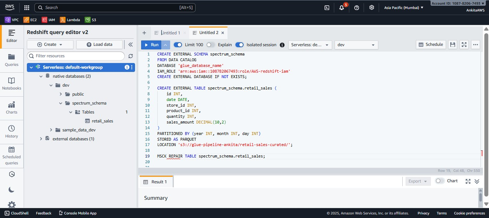


### 📌 7. Athena View → QuickSight Dashboard =

#### 7.1) Create a View in Athena (Query Editor v2) -

- Go to Amazon Athena

- Open Query Editor v2

- On the left side:

- Data source → AwsDataCatalog

- Database → glue_database_name

- Click New Query

- Run the view creation query:
```
CREATE OR REPLACE VIEW glue_database_name.retail_sales_clean AS
SELECT 
    id,
    date,
    COALESCE(store_id, 'Unknown') AS store_id_fixed,
    product_id,
    COALESCE(quantity, 0) AS quantity_fixed,
    COALESCE(sales_amount, 0) AS sales_amount_fixed,
    year,
    month,
    day
FROM glue_database_name.retail_sales;
```

- Run:
```
SELECT * FROM glue_database_name.retail_sales_clean LIMIT 10;
```

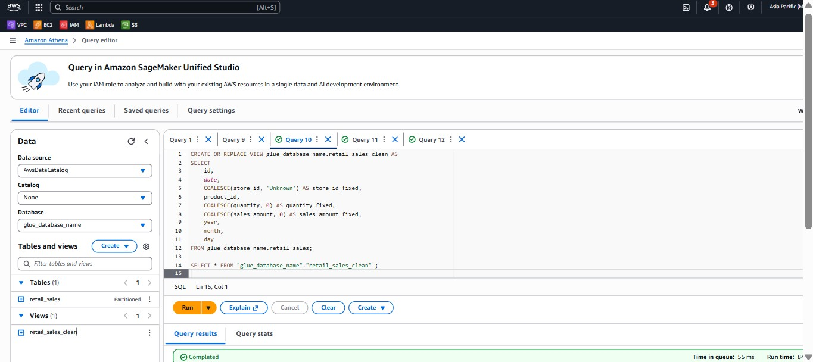

#### 7.2) Create Dataset in QuickSight (Athena Source)

- Go to QuickSight → Datasets

- Click New dataset

- Choose Athena

- Name it : retail_sales_clean

- Select:

  ->Data Source → AwsDataCatalog

  -> Database → glue_database_name

  -> Table → retail_sales_clean (view you created)

- Choose One -

  -> Import to SPICE(Recommended)

  -> Directly query your data

- Click Visualize
This will create an Analysis.

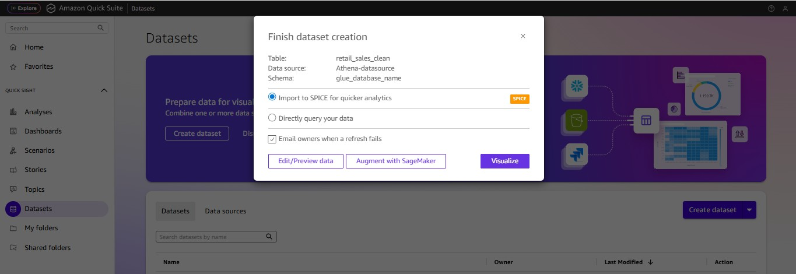
---
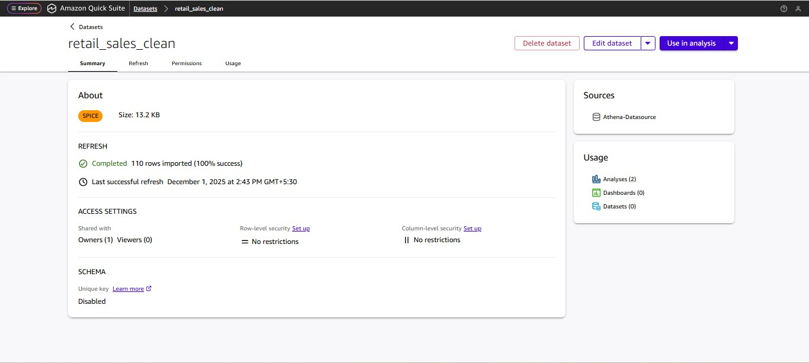

#### 7.3) Build Dashboards in Amazon QuickSight -

- Choose Vertical bar chart

- Set fields:

  -> X-axis : store_id_fixed

  -> Value : sales_amount_fixed → Aggregate = SUM

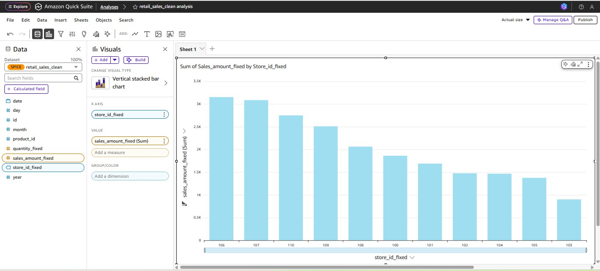
---
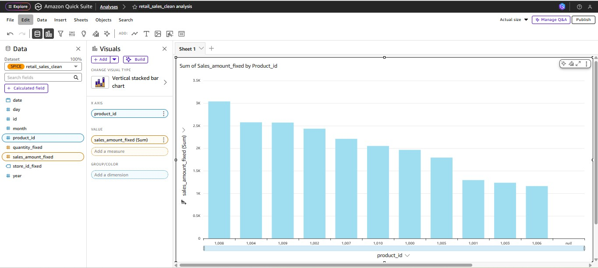
